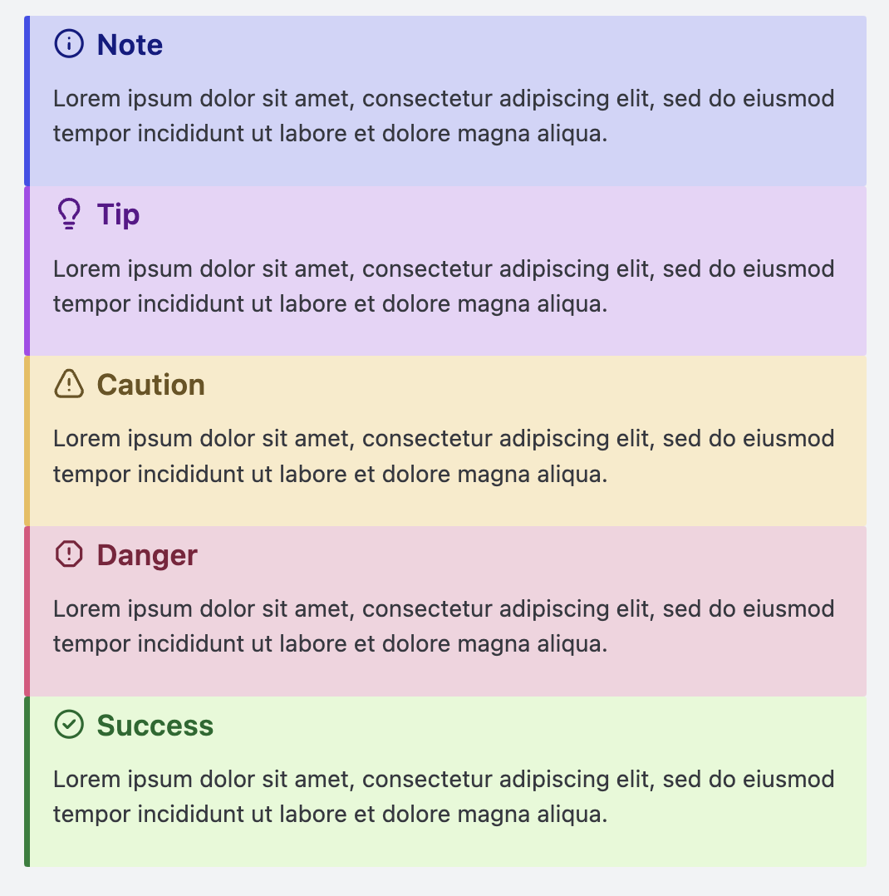
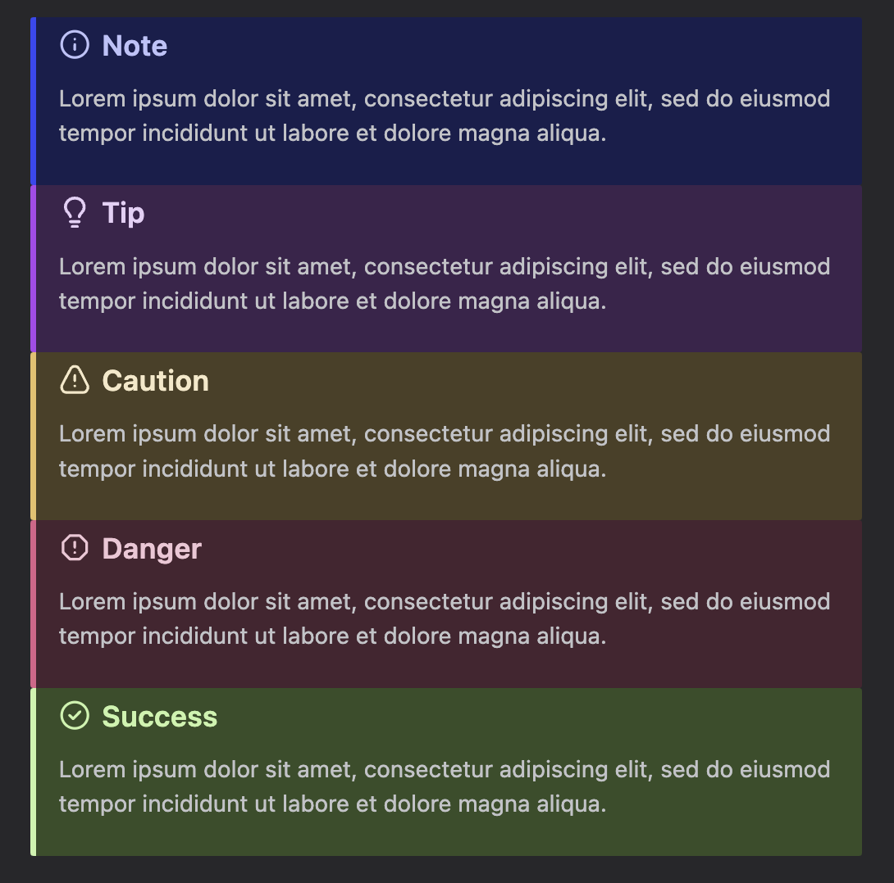

# Starlight's `<Asides/>`s for Astro md/mdx

Add asides with remark directives
[npm package](https://www.npmjs.com/package/astro-starlight-remark-asides)

1. note
2. tip
3. caution
4. danger
5. success

```md
:::note[Title]
text
:::
```

## Dark and light theme

uses `:root[data-theme="dark"]` by default, but this can be changed on line 21 of `styles.css`




## Requirements

`astro-starlight-remark-asides` requires the `remark-directive` plugin to be added to your remark plugins before using.

## Copy files and use

1. the `.js` file here is a remark plugin, import it and add it to your remark plugins

```ts
import { defineConfig } from "astro/config";
import remarkDirective from "remark-directive";
import astroStarlightRemarkAsides from "./src/path/to/index.js";

// https://astro.build/config
export default defineConfig({
  markdown: {
    remarkPlugins: [remarkDirective, astroStarlightRemarkAsides],
  },
});
```

2. Import the .css file into whatever path is rendering the md/mdx

```ts
// src/[slug].astro
---
import "src/path/to/styles.css";
---
<!--  -->
```

## Use as npm package

1. import the remark plugin and add to remark plugins

```ts
import { defineConfig } from "astro/config";
import remarkDirective from "remark-directive";
import astroStarlightRemarkAsides from "astro-starlight-remark-asides";

// https://astro.build/config
export default defineConfig({
  markdown: {
    remarkPlugins: [remarkDirective, astroStarlightRemarkAsides],
  },
});
```

2. Import the .css file into whatever path is rendering the md/mdx

```ts
// src/[slug].astro
---
import "astro-starlight-remark-asides/styles.css";
---
<!--  -->
```
